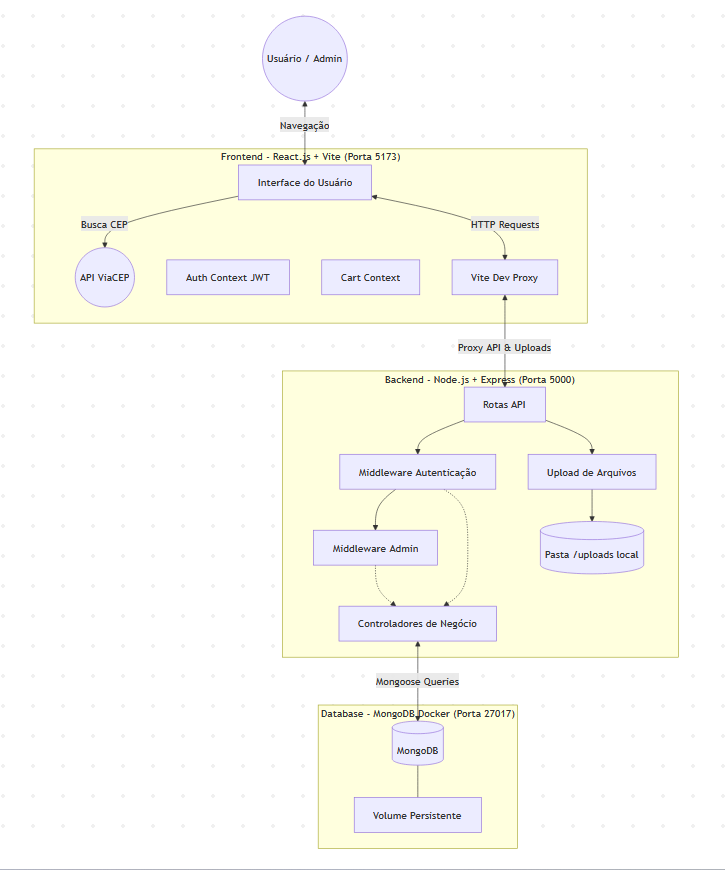

# Arquitetura do Sistema: Artesanato E-commerce

O sistema foi desenhado visando ser modular, seguro e performático. Abaixo detalhamos a infraestrutura e o fluxo de dados em formato visual e textual.

## Diagrama da Arquitetura

## Componentes Principais

### 1. Frontend (React.js)
- **Roteamento SPA:** Utiliza `react-router-dom` para navegação instantânea sem recarregar a página (ex: ao finalizar um pedido no Checkout).
- **Gerenciamento de Estado:** Utiliza `Context API` para manter os dados do Carrinho (`CartContext`) persistentes durante a sessão de compra e os dados do Usuário Logado (`AuthContext`).
- **Integração Externa:** Comunica-se diretamente com a API do ViaCEP durante o Checkout para preenchimento automático de endereço sem sobrecarregar nosso próprio servidor.

### 2. Backend (Node.js + Express)
- **Segurança (JWT):** Utiliza tokens assinados para manter o estado de login e verificar quem está fazendo as requisições. O `adminMiddleware` protege as rotas de criação de produtos e relatórios de vendas.
- **Tratamento de Erros:** Utiliza a biblioteca `express-async-errors` para capturar falhas em funções assíncronas (como consultas de banco) impedindo o "crash" do servidor.
- **Uploads Físicos:** Através do `multer`, imagens são salvas fisicamente em uma pasta `uploads/` isolada e servidas publicamente através de `express.static`.

### 3. Banco de Dados (MongoDB)
- **Isolamento Docker:** Roda em um container separado pela porta 27017, facilitando o deploy.
- **Persistência de Dados:** Configurado com *Volumes do Docker* (`mongo_data`) para garantir que mesmo se o container for apagado ou atualizado, os dados de produtos e usuários não se percam.

[def]: diagrama-arquitetur.png